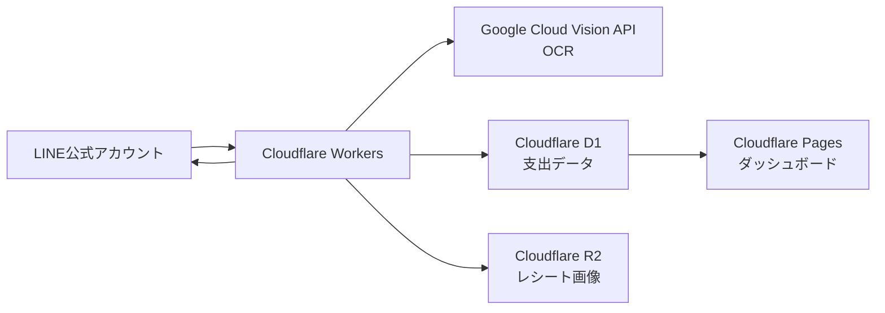

## LINEにレシートを送るだけ。個人用家計簿をCloudflareで作ってみました

家計簿は続けることが一番むずかしい、とよく言われます。

私も何度かアプリや表計算ソフトで家計簿を始めましたが、「レシートを撮影して、アプリを開いて、金額を入力して……」という小さな手間が積み重なり、いつの間にか止まってしまいました。

そこで今回は、普段から使っているLINEにレシート写真を送るだけで支出を記録できる、個人用の家計簿アプリを作りました。この記事では、初心者の方にも伝わるように、全体の仕組みや使った技術、工夫した点を紹介します。

## 完成したアプリでできること

このアプリでは、LINE公式アカウントにレシート画像を送ると、次のように動きます。

1. レシートの文字をOCRで読み取ります。
2. 合計金額・店舗名・利用日を取り出します。
3. 「食費」「交通費」「娯楽費」などのカテゴリを推定します。
4. 支出データを保存し、LINEで登録結果を返します。
5. ダッシュボードで週・月・好きな期間の支出を確認できます。

たとえば、LINEへレシートを送ると、`¥1,200 スーパーで登録しました。` のように返信されます。

画像だけではありません。`昨日、コンビニで500円使った` のような文章でも記録できます。読み取りが間違っていた場合は、`さっきの金額を1,200円に修正して` と送ることで、直前の登録内容を修正できるようにしました。

## 全体の構成

今回の構成は次のとおりです。



名前だけ見ると少し難しそうですが、それぞれの役割はシンプルです。

| 技術 | 役割 |
| --- | --- |
| LINE Messaging API | LINEのメッセージを受け取り、返信する窓口です。 |
| Cloudflare Workers | アプリの「頭脳」です。LINE、OCR、データベースをつなぎます。 |
| Google Cloud Vision API | レシート画像から文字を読み取るOCR担当です。 |
| Cloudflare D1 | 金額、日付、カテゴリなどを保存するデータベースです。 |
| Cloudflare R2 | 元のレシート画像を保存する場所です。 |
| Cloudflare Pages | ブラウザで見るダッシュボードを公開します。 |

サーバーを自分で用意しなくても、Cloudflareのサービスを組み合わせることで、小さな個人用アプリを作れました。

## レシートが登録されるまで

レシート写真を送信してから登録されるまでの流れを、もう少し詳しく見てみます。

まず、LINEは設定したWebhook URLにイベントを送ります。Webhookは「何かメッセージが届きました」とアプリへ知らせる仕組みです。

Workerでは、LINEから届いたリクエストが本物かどうかを署名で確認します。署名が正しくなければ、処理しません。確認できたら、LINEの画像取得APIからレシート画像を受け取り、R2へ保存します。

続いて、画像をGoogle Cloud Vision APIへ送り、`DOCUMENT_TEXT_DETECTION`で文字を読み取ります。OCRの結果は、きれいな表ではなく、改行を含む普通の文字列として返ってきます。

そこで自作のパーサーを使い、文字列から必要な情報を探します。

```text
FOOD BASKET
2026年8月12日
合計 ¥897
```

このような文字列から、店舗名を`FOOD BASKET`、日付を`2026-08-12`、金額を`897`として保存します。

## 「小計」ではなく「合計」を選ぶ工夫

レシートOCRで意外に難しかったのは、金額の選び方です。

レシートには商品の単価、小計、消費税、預かり金、おつりなど、たくさんの数字が載っています。単純に「一番大きな数字」を選ぶと、預かり金を支出として登録してしまうことがあります。

そこで、次のようなルールを作りました。

- `合計`、`お会計`、`TOTAL` などの近くにある金額を最優先する
- `小計`、`消費税`、`おつり`、`値引き` の近くにある金額を除外する
- ラベルと金額が別の行にあるレシートにも対応する
- 候補が不明な場合は、無理に確定せず「要確認」として保存する

完璧なOCRは難しいため、「自動化しつつ、間違えたときに直しやすい」ことを大切にしました。

## カテゴリはどうやって決めているのか

カテゴリは、店舗名やOCR全文に含まれる言葉から推定しています。

たとえば、コンビニやスーパーなら食費、JRやバスなら交通費、映画館なら娯楽費、といったルールです。

```text
セブンイレブン → 食費
JR東京駅 → 交通費
TOHOシネマズ → 娯楽費
薬局 → 日用品
```

この方法はAIモデルを使うより単純ですが、個人用アプリでは十分実用的です。誤分類された場合は、ダッシュボードやLINEから後で変更できます。

## 文章だけでも登録できるようにした理由

現金を少し使ったときや、レシートを受け取らなかったときもあります。そのため、文章入力にも対応しました。

以下のように、少し表現が違っても登録できます。

```text
コンビニで500円使った
昨日、JRで1,240円払った
8/15 映画 1,900円
```

ここで大切なのは、便利さより誤登録を防ぐことです。`パン300円と牛乳200円を買った` のように金額が複数ある文章は、どちらを登録すべきか分かりません。そのため、このアプリでは勝手に登録せず、1メッセージにつき1支出にしてもらうよう案内します。

## ダッシュボードと定期レポート

ダッシュボードはCloudflare Pagesで公開しています。週だけでなく、開始日と終了日を指定して好きな期間を確認できます。

表示する内容は、合計支出、カテゴリ別の内訳、日別の推移、要確認レシートなどです。削除や金額・カテゴリの修正もできます。

さらに、毎朝は前日分、月曜は先週分、毎月1日は先月分のレポートをLINEへ送るようにしました。レポートには、合計、前期間との比較、カテゴリ別円グラフ、日別棒グラフ、上位カテゴリを含めています。

画像レポートはCloudflare Browser RunでHTMLをPNGに変換して作ります。作成した画像はR2に保存し、期限付きのURLをLINEに渡します。元のレシート画像を公開しない点も重要です。

## 個人用でもセキュリティは大切

家計簿には金額や行動の情報が入るため、個人用でも安全性を意識しました。

- LINE Webhookの署名を検証する
- APIはBearerトークンで保護する
- 秘密情報はソースコードに書かず、CloudflareのSecretとして保存する
- レシート画像は非公開のR2バケットへ置く
- ダッシュボードはCloudflare Accessで本人のメールアドレスだけに制限する
- レポート画像は短期間だけ有効な署名付きURLで渡す

特にCloudflare Accessは便利でした。URLを知っているだけではダッシュボードを開けず、許可したメールアドレスで認証した場合だけ閲覧できます。

## テストも少しずつ書く

「実際のレシートで動くか」を確認するため、OCRパーサーやLINE署名検証、文章入力のテストをVitestで書きました。

たとえば、次のようなケースを確認しています。

- コンビニ、スーパー、飲食店のレシート
- 小計と合計が両方あるレシート
- 日本語の日付表記
- 文章での支出登録
- 複数の金額がある文章を登録しないこと
- LINE署名が正しくないリクエストを拒否すること

小さなアプリでも、金額を扱う処理は特にテストが大切だと感じました。

## 作ってみて感じたこと

今回作ってみて、家計簿アプリの難しい部分は、データベースや画面そのものよりも「入力をどれだけ自然にできるか」だと感じました。

レシート撮影、文章入力、LINEでの修正、定期レポートを用意することで、家計簿を開く回数を減らせました。記録のために別の行動を増やすのではなく、普段使っているLINEの中に記録の入口を置けたことが、一番大きな改善です。

今後は、カテゴリ判定の精度向上、予算超過のお知らせ、月ごとの傾向分析なども追加してみたいです。

まずは、自分が毎日使いたくなる小さな仕組みを作るところから始めてみるのがおすすめです。
